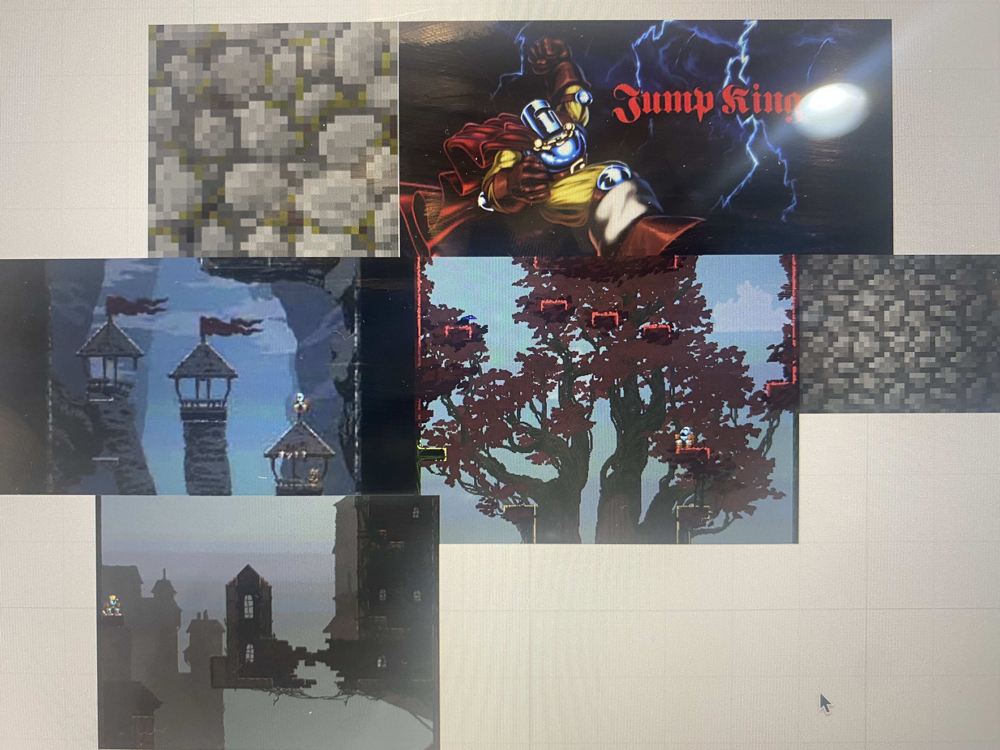
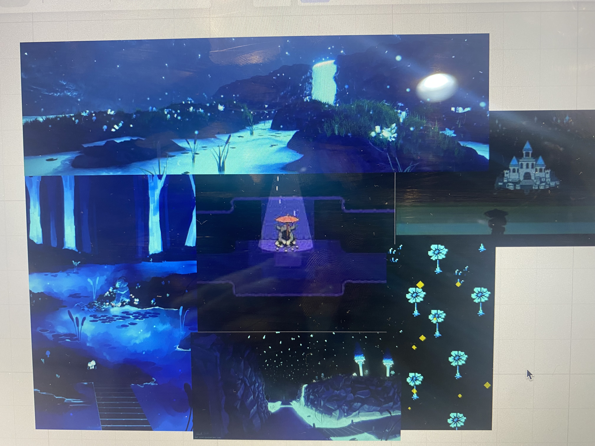
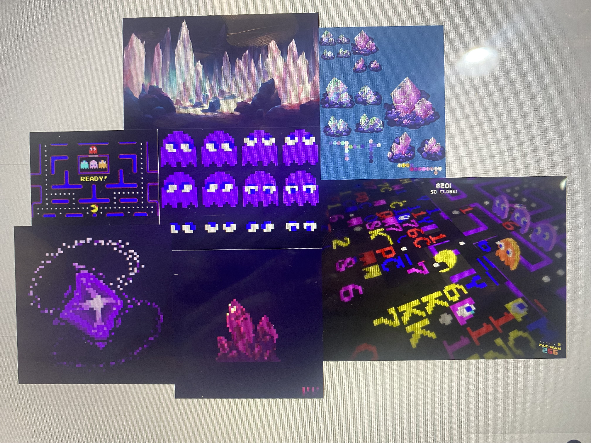

# Project Name

Fairy Frenzy

# By (The Coders)

Members:
Adam Bartnik - 2403588
Jessica Fox - 2404558
Jasveen - 2402376
Ish - 2410313

# Overview of game

Our Game is inspired by pacman and other similar simple point based games. The goal being to gain as many powerups as you can and get the highest score while avoiding any enemy you may encounter. Within Fairy Frenzy you play as a small fairy called Navi collecting different objects of various colours aiming to chase away that dark mysterious shadows that follow you through a set of abandoned ruins. Collect as many star shards, potions and emeralds as you can to chase away the darkness and make you light burn brighter by gaining points.

# Individual Contributions

Jess - created all the assets/ art and mood boards, Created and wrote the README file in charge of the artistic feel of the project and writing about why we have chosen to code in the manner we have. In charge of narratve and story elements.

Adam - Created the Tilemap mechanics as well as the chunk system. Working heavily on the camera and implementing translate to make the player always visible, implamenting code into the main branch while making sure that it works in a coheasive manner.

Jasveen - Implemented the points system and how the power ups interact with the player class and how many points each powerup should give the player.Got the enemies to chase and interact with the player across the map in an effective manner.

Ish - Assisted Jasveen with the points system and provided insight of the intricacies of how to effectivly join together our code in a more efficient manner. responsible for looking at the code as a whole and provide feedback on the direction of the project.

# Themes

The main theme of our game is fantasy, a fantasy world rooted in a providing a stimulating but relaxing experience for our player. Themes of nature, exploration and feedom, being given full control of where you go on the map allows the player to feel as though they are able to remain in control of what they see and what they dont. As the main artist i specifically chose dark and light contrasting colours to show the vibrance in nature from dark leaking stone to bright flowers that give the feeling of a place long abandoned that they player has the first chance to explore. Giving the player this feeling of exploration in a non stressful enviroment allows for a unique experience similar to the games i took inspiration from. 

# Game Design

Our game was designed after older arcade style games that requre the player to gain the highest score they can while being chased by enemies, we designed the game to work in a similar way to pacman being able to gain points while avoiding ghosts. However we aslo wanted the game to be fun and not extremely stressful we think its very important to find the balace between the feeling that push to keep moving and gain more points while also being in a fun colourful environment that is pleasing and cohesive to the eye that possibly adds that nostalgic comforting feeling that games like legend of zelda or pac man tent to give. The points system was constructed to be unique possibly giving the player a differing amount of points based on the powerup they choose.Our game combines both camera angles, points sytems and active enemies with fun designs and an intresting narrative to provide our player with a feeling of nostalgia and intrigue, hoping to give a fun experience by specifically modifying our code to meet those needs. 
Having the main player confined to the tiles once again ushers in that urgency to gain more points and move faster much like pacman the enemies seem to move faster. with the enemies not restricted like the player is it encourages that feeling of urgency all the more.

# Narrative

The Narrative of our game follows a little fairy called Navi (from one of our game inspirations) who must escape a set of abandoned ruins by collecting as many star shards, potions and emeralds as they can in order to shine as bright as they can and outrun the shadow creatures haunting the ruins. Navi must navigate around the crystals that reside within the ruins while avoiding her perusers while not allowing the darkness around her to down our her light, she collects star shards, potions and emeralds to make her light shine brighter and outrun her enemies. Should she fail thr darkness of the ruins may consume her.

In terms of the overall narrative there where points where i worried that themes and ideals may clash such as the original game centered around a relaxing experience for our target audience without a stressful enviroment however with the implementation of enemies the pressure on the player would gradually grow making the tone of the game shift. However i feel that even with the enemies chasing the player the game still retains a whimsical calm feeling while keeping the player moving and focussing on collecting points therefore keeping the games true goal of point progression a priority while keeping with the themes and aesthetics of the game.

# Aesthetic

To provide a fun and nostalgic feeling for our player i took inspiration from the legend of zelda franchise such as majoras mask and ocarina of time,pac man, mario, and princess quest. As the artist i took heavy inspiration from these games as i knew i wanted certain parts such as the powerups to not contrast too heavily with the world around them or any enemies that may be on the screen i specifically chose the objects that i wanted our fairy to collect as well as what possible enemies(should they be implamented ) may look like. While keeping true to that fantastical creature theme that sets the overall narrative for the game. In the process of which i created differing moodboards where you can clearly see what aethetics, colours and forms i took inspiration from all within the genre of pixel based rpg style games.

# Mood Boards

I chose specific items to create for powerups such as emeralds relating back to legend of zelda and how the currency of the game centers around emeralds linking to how the our main little fairy character was taken from that franchise, i thought it would make the most sense to add these little hints at inspiration but also link together why the fairy has chosen to collect these objects. The second powerup was a little light shard, these where more original and i specifically chose a little star as i wanted the fairy to seem as if it where collecting pieces of light in order to be able to light up the ruins and see the path forward.The enemies where inspired by different dragons and clouds of smoke, i wanted them to almost seem snake or ghost like with claws and horns adding that sharp grim aspect that tipical fairytale dragons have. It worked out quite well with the way the enemies ended up moving as they almost float across the screen instead of how the fairy can only move acording to the tiles, it really adds to the feeling that the enemies are floating through the ruins like clouds of smoke.

# Concept Art

Experimental sketch art depicting the colours and flow we decided that the game should have.
The enviroment is dark and overgrown allowing for that theme of adventure to be realised while at contrast with the light baby blue of our main player who lights the way tying nicely into the fantasy genre that we where hoping to achive, the dragons stalking closer to push the player to gain as many points as they can therefore creating an effective game cycle  with the inclusion of the differeing mechanics within the code.
# Author

Jessica Fox
