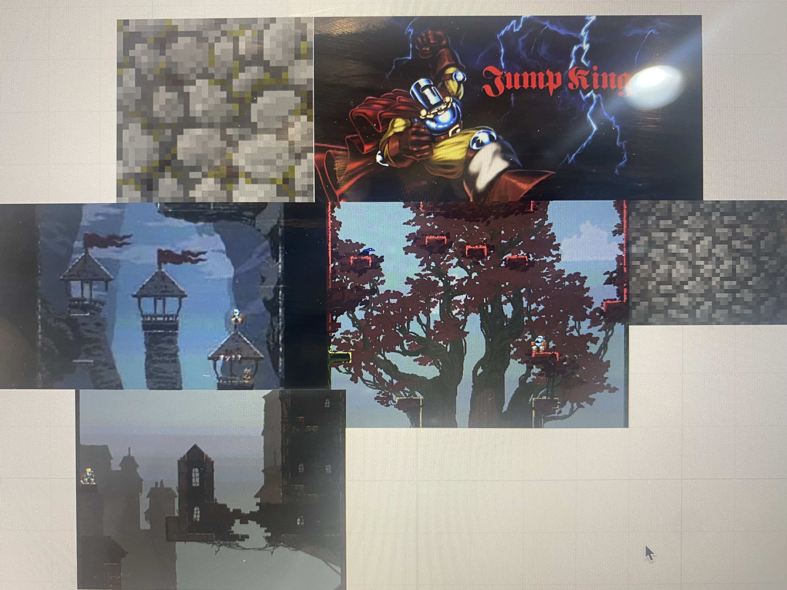
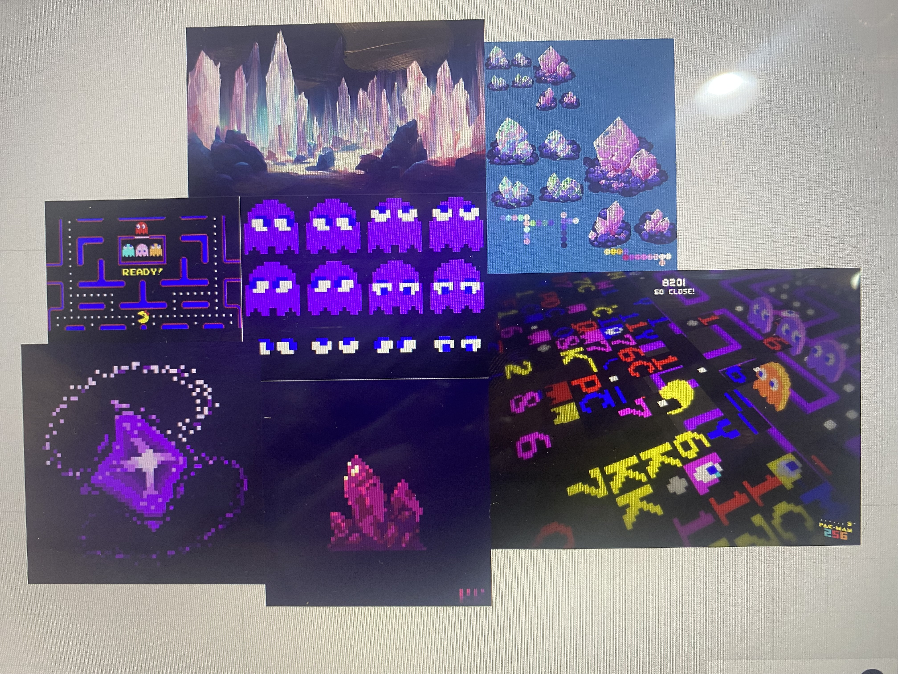

# Project Name
Runaway Raceway

# By (The Coders)
Members: 
Adam - 2403588
jess - 2404558
Jasveen - 2402376

# Overview of game
Our Game is inspired by pacman and other similar simple survival games. The goal being to last as long as you can while gaining points from different power ups.

# Individual Contributions
Jess - created all the assets and mood boards as well as making the enemy class and getting it to chase and interact with the player. Created and wrote the README file.

Adam - Created the Tilemap mechanics as well as the chunk system. Working heavily on the camera angels and implementing translate to get the player to move in the most effective way.

Jasveen - Implemented the points system and how the power ups interact with the player class and how many points each powerup should give the player. 

# Themes 
Our major themes where inspired by pre-existing fantasy games with a lighthearted enviroment. We didnt want a heavy or stressful tone to weigh down on our player, so we created fun deisgns that are bright and pleasing to the eye.

# Game Design
Our game was deisgn after retro arcade style simple games that requires the player to survive for long periods of time while avoiding enemies and gaining powerups in the persuit of gaining the highest score. We plan to incorporate chase and powerup mechanics to our final games relying heavily on camera angles to provide a unique and fun experience for the player. If time would permit we would love to ensure these features make their way to the final game in a fun and intresting way.

# Narrative
The narratives elements of our game leave a heavy impact on the player, we understand this. Through the Mechanics of our game we hope to provide an open ended and carefree narrative that allows the player to make of the game what they wish. leaving it open to be interpreted in whatever way the player wishes much like pacman that doesnt follow a set narrative.

# Aesthetic
To provide a fun and nostalgic feeling for our player we took inspiration from legend of zelda, pac man, mario, princess quest and many more different games.

# Author
Jessica Fox